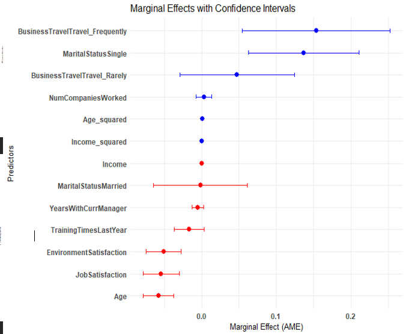
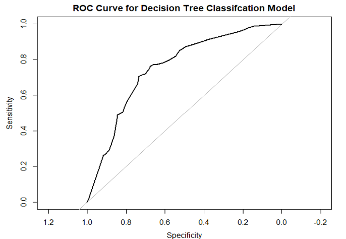
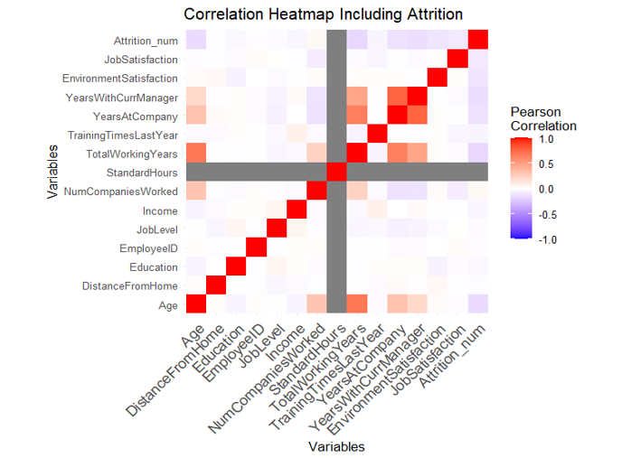

# Canterra Employee Attrition Analysis

## Overview
This repository contains a comprehensive analysis of employee turnover at Canterra. The project identifies key factors driving attrition and offers actionable recommendations to reduce turnover rates. By leveraging data-driven insights and predictive modeling, this project aims to improve employee satisfaction, reduce costs associated with high turnover, and foster a stable and high-performing workforce.

---

## Features

### **Exploratory Data Analysis**
- **Correlation Heatmaps**: Visualizing relationships between age, income, job satisfaction, tenure, and attrition.
- **Key Trends**:
  - Higher turnover among employees under 25.
  - Increased attrition linked to income disparities and job dissatisfaction.
  - Frequent business travel correlates with higher attrition rates.

### **Predictive Models**
- **Logistic Regression**:
  - Focused on binary classification of employee attrition.
  - Identified top predictors: job satisfaction, income, age, and tenure.
- **Decision Tree**:
  - Provided interpretable insights into decision paths.
  - Highlighted tenure, income, and age as key drivers of attrition.
- **Bagged Tree**:
  - Reduced variance and improved predictive stability.
  - High ROC AUC score of 0.943.
- **Random Forest**:
  - Best-performing model with ROC AUC of 0.972.
  - Accurately identified high-risk employees while minimizing overfitting.

### **Model Evaluation**
- **ROC Curves**:
  - Evaluated models’ performance with both training and testing datasets.
- **Sensitivity and Specificity**:
  - Assessed true positives and negatives for each model.
- **Feature Importance**:
  - Analyzed key factors like income, job satisfaction, and age.

---

## Some Key Visualizations
### Marginal Effects wtih Confidence Intervals


### ROC Curve for Decision Tree


### Heatmap of Correlation



## Workflow

1. **Data Preparation**
   - Cleaned and transformed the dataset.
   - Addressed class imbalance with stratified sampling.
   - Converted categorical variables to numerical formats.

2. **Model Development**
   - Built and compared Logistic Regression, Decision Tree, Bagged Tree, and Random Forest models.
   - Conducted hyperparameter tuning and cross-validation.

---

## Random Forest Model Code Snippet
```r
rf_model <- 
  train(
    Attrition ~ ., # formula
    data = train[Attrition_idx, ] |> # data
      select(
        -EmployeeID
      ) |>
      drop_na(),
    method = "rf",      # Random Forest method
    trControl = trainControl(
      method = "cv", number = 10, # 10-fold cross-validation
      classProbs = TRUE,  # Enable probability predictions
      summaryFunction = twoClassSummary  # Use twoClassSummary to compute AUC
    ),
    metric = "ROC" # "ROC" gives us AUC & silences warning about Accuracy
  )

rf_model # summary

rf_model$finalModel # details of the Random Forest model

rf_model$resample # cross-validation results

vip <- varImp(rf_model) # variable importance

vip

plot(vip, main = "VIP For Random Forest")
